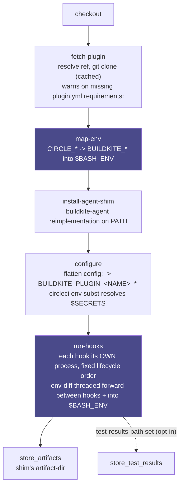

# Architecture

## How it works

1. **`fetch-plugin`** resolves your plugin reference the same way Buildkite does:
   `name#ref` (the `buildkite-plugins` GitHub org), `org/name#ref`, or a full
   `https://`/`ssh://`/`file://` git URL, optionally with an in-repo subdirectory, then
   git-clones it at the pinned ref, cached. **Caching only ever applies to a pinned
   ref** (`#tag` or `#sha`): an unpinned reference (a mutable branch, or no `#ref` at
   all) always re-clones fresh, on every run, regardless of `plugin-cache` (see
   [Limits](LIMITS.md) for why). It also warns (non-fatally) if the cloned
   plugin.yml's `requirements:` list names a command missing from `$PATH`. Real
   Buildkite agents never install these either, so a missing one is a host-setup gap
   either way; better to see that up front than as a mysterious failure inside a hook.
2. **`map-env`** exports CircleCI's own job-context variables under their documented
   Buildkite names (`BUILDKITE_BRANCH`, `BUILDKITE_COMMIT`, ...); see the
   [mapping table](#circle_-to-buildkite_-environment-mapping) below.
3. **`install-agent-shim`** puts a `buildkite-agent` shim on `$PATH`, since plugin
   hooks unconditionally shell out to it; see the
   [subcommand table](#buildkite-agent-subcommands) below.
4. **`configure`** flattens your `config:` YAML onto `BUILDKITE_PLUGIN_<NAME>_<KEY>`
   variables following Buildkite's own documented config-flattening convention
   (independently verified against real plugin configs and hooks; see
   [Config flattening](#config-flattening)), after passing it through
   `circleci env subst` so you can reference `$MY_SECRET` without the value ever
   appearing in your CircleCI config.
5. **`run-hooks`** runs the plugin's `hooks/*` files, each as its **own process**, in
   Buildkite's documented lifecycle order; see
   [Hooks and their CircleCI-native equivalents](#hooks-and-their-circleci-native-equivalents).
   This is the part that's easy to get subtly wrong: `buildkite-agent` doesn't source
   every hook into one long-lived shell. It runs each hook in its own process, diffs
   the environment before and after, and threads *only that diff* (added, changed, and
   removed variables, plus the hook's final working directory) into the next hook and
   the command. This orb reimplements that diff-and-thread mechanism exactly, rather
   than taking the simpler (but subtly wrong for many real plugins) shortcut of
   sourcing every hook into one shell. The final accumulated diff is exported into
   `$BASH_ENV`, so native CircleCI steps after this one see it too.
6. **`plugin`** is the aggregate of all four: the one most users call directly, as
   either a command (inline among native steps) or a job (`buildkite/plugin`, callable
   from a workflow, with CircleCI's own native `pre-steps`/`post-steps` available for
   interleaving, see [Getting Started](GETTING-STARTED.md#interleaving-native-circleci-steps-around-the-plugins-hooks),
   and an automatic `store_artifacts` for whatever the hooks staged via
   `buildkite-agent artifact upload`).



**The trickiest mechanism here is the env-diff threading inside `run-hooks`.** Real
`buildkite-agent` doesn't source every hook into one long-lived shell. It runs each
hook as its own process, diffs the environment before and after, and threads *only that
diff* (added/changed/removed variables, plus the hook's final working directory) into
the next hook. This orb reimplements that exactly, which is also why it needs the most
regression coverage of the four sibling orbs (exit-code precedence, env-diff threading
itself, fetch idempotency); see [Verified targets](LIMITS.md#verified-targets-and-what-verified-means-for-each)
in Limits.

## `CIRCLE_*` to `BUILDKITE_*` environment mapping

Set by `map-env` (and by `plugin`/the `plugin` job, which call it by default; set
`map-env: false` to skip it).

| Buildkite variable | Set from | Notes |
|---|---|---|
| `BUILDKITE` | (constant) | Always `"true"`. |
| `BUILDKITE_AGENT_NAME` | (constant) | Always `"circleci"`. |
| `BUILDKITE_PIPELINE_PROVIDER` | `CIRCLE_REPOSITORY_URL` | Guessed from the URL's host (`github`/`bitbucket`/`gitlab`/`unknown`). |
| `BUILDKITE_BUILD_CHECKOUT_PATH` | `CIRCLE_WORKING_DIRECTORY` | Falls back to `pwd`. |
| `BUILDKITE_BRANCH` | `CIRCLE_BRANCH` | |
| `BUILDKITE_COMMIT` | `CIRCLE_SHA1` | |
| `BUILDKITE_TAG` | `CIRCLE_TAG` | |
| `BUILDKITE_PULL_REQUEST` | `CIRCLE_PULL_REQUEST` | The PR number, or the string `"false"` if this isn't a PR build; matches Buildkite's own documented value exactly. |
| `BUILDKITE_ORGANIZATION_SLUG` | `CIRCLE_PROJECT_USERNAME` | |
| `BUILDKITE_PIPELINE_SLUG` | `CIRCLE_PROJECT_REPONAME` | |
| `BUILDKITE_BUILD_NUMBER` | `CIRCLE_BUILD_NUM` | |
| `BUILDKITE_BUILD_ID` | `CIRCLE_WORKFLOW_ID` | |
| `BUILDKITE_JOB_ID` | `CIRCLE_WORKFLOW_JOB_ID` | |
| `BUILDKITE_REPO` | `CIRCLE_REPOSITORY_URL` | |
| `BUILDKITE_BUILD_URL` | `CIRCLE_BUILD_URL` | |

**Deliberately left unset, because no CircleCI equivalent exists:** `BUILDKITE_AGENT_ACCESS_TOKEN`
and `BUILDKITE_AGENT_ENDPOINT` are a real, per-job bearer token and API endpoint issued
by Buildkite's control plane; there is no CircleCI concept that produces an equivalent,
because there is no Buildkite account in this picture at all. A plugin that requires
either of these (rather than one of the `buildkite-agent` subcommands the shim covers)
will not work here.

Add or override entries with `extra-env` (one `KEY=VALUE` per line, applied after the
base mapping, also passed through `circleci env subst`). An entry naming a reserved
shell/interpreter-control variable (`PATH`, `BASH_ENV`, `IFS`, `LD_PRELOAD`, and
similar; the same list the sibling `bitbucket` orb's `map-env` and `harness` orb's
`collect-outputs` already enforce) is refused with a warning, never exported: every
later step in the job sources `$BASH_ENV`, so letting a hook (or a copy-paste mistake)
rewrite one of these would affect every subsequent step, not just this one.

## Config flattening

`configure` reimplements Buildkite's own documented config-flattening convention
(independently verified against real plugin configs and the hooks that read them; see
[Verified targets](LIMITS.md#verified-targets-and-what-verified-means-for-each)), against
a deliberately small subset of block-style YAML: scalars, sequences (including sequences
of scalars and sequences of mappings, e.g. a list of `- key: value` items, each flattened
the same way a nested mapping would be), and (arbitrarily nested) mappings. No flow-style
(`{a: b}`), multi-line scalars, anchors/aliases, or same-line trailing `#` comments.
Every real config in the vault-secrets, aws-assume-role-with-web-identity and trivy
plugins' own READMEs (this orb's verified targets) parses correctly with this subset;
see [`src/examples/`](../src/examples/) for the exact plugin.yml-verified shapes.

```yaml
config: |
  server: "https://my-vault-server"
  path: secret/buildkite
  auth:
    method: "approle"
    role-id: "my-role-id"
```

flattens to:

```
BUILDKITE_PLUGIN_VAULT_SECRETS_SERVER=https://my-vault-server
BUILDKITE_PLUGIN_VAULT_SECRETS_PATH=secret/buildkite
BUILDKITE_PLUGIN_VAULT_SECRETS_AUTH_METHOD=approle
BUILDKITE_PLUGIN_VAULT_SECRETS_AUTH_ROLE_ID=my-role-id
```

The `<NAME>` prefix is derived from the plugin's **repository name**, not the `name:`
field inside `plugin.yml`: stripping a trailing `-buildkite-plugin` suffix, then
uppercasing with hyphens/spaces turned into underscores. A plugin referenced by a full
git URL whose repo doesn't end in `-buildkite-plugin` gets `_GIT` appended (both rules
independently verified against Buildkite's own documentation and by fetching real
plugin repos and checking their derived prefix against what their own hooks read).

**Not implemented:** `BUILDKITE_PLUGIN_CONFIGURATION` (the whole config as one JSON
string) and `BUILDKITE_PLUGIN_VALIDATION`-gated schema validation against `plugin.yml`'s
`configuration` JSON Schema. See [Limits](LIMITS.md) and [ROADMAP.md](ROADMAP.md) item 2.

## Hooks and their CircleCI-native equivalents

`run-hooks` runs whichever of these hook files exist, **in this order**, each as its
own process:

`environment` → `pre-checkout` → `checkout` → `post-checkout` → `pre-command` →
`command` → `post-command` → `pre-artifact` → `post-artifact` → `pre-exit`

The `hooks` parameter is a **filter, not a sequence**: it only controls *which* of
these hook names run; the order you list them in that comma-separated string is
cosmetic and never affects execution order, which is always the fixed lifecycle order
above.

By default it runs everything **except `checkout`, `pre-artifact` and `post-artifact`**:
those three have a CircleCI-native equivalent good enough that overriding it needs a
deliberate opt-in, via the `hooks` parameter:

- **`checkout`** completely replaces Buildkite's own git clone/fetch/checkout logic.
  On CircleCI, the native `checkout` step also wires up your project's checkout keys/
  deploy key; this orb will not silently bypass that. The `plugin` job's `checkout`
  parameter (default `true`) controls the **native** CircleCI checkout; a plugin's own
  `hooks/checkout` only runs if you explicitly add `checkout` to the `hooks` list, and
  even then it runs *after* CircleCI's native checkout (not instead of it, and not
  before it as Buildkite would run it). That's fine for a hook that only needs the
  checkout path to exist by the time it runs (this orb's trivy target's `pre-checkout`
  hook is exactly this shape); it's wrong for a hook that means to replace checkout
  entirely.
- **`pre-artifact`/`post-artifact`** only fire in real Buildkite when the step has
  `artifact_paths` set. This orb has no equivalent declarative concept: add
  `pre-artifact`/`post-artifact` to `hooks` explicitly and wire your own
  `store_artifacts` (or use the `plugin` job's automatic one, over the shim's artifact
  directory) if a plugin's artifact hooks matter to you.

### Defaults that deviate from real `buildkite-agent`

This orb intentionally overrides one default from real Buildkite's own hook lifecycle:

| Parameter | Real `buildkite-agent`'s own default | This orb's default | Why |
|---|---|---|---|
| `hooks` | Runs **every** hook file present in the plugin's `hooks/` directory, unconditionally, in the fixed lifecycle order documented at [`buildkite.com/docs/agent/hooks`](https://buildkite.com/docs/agent/hooks). | `environment,pre-checkout,post-checkout,pre-command,command,post-command,pre-exit`; filters out `checkout`, `pre-artifact`, `post-artifact` by default. | The three filtered-out hooks each already have a CircleCI-native equivalent good enough that overriding it needs a deliberate opt-in; see the bullets above. |

Every other default in this orb (`always-clone-fresh: false`, `plugin-cache: true`, an empty
`test-results-path`) matches Buildkite's own documented default (`BUILDKITE_PLUGINS_ALWAYS_CLONE_FRESH`
defaults to `false` on real Buildkite too; real Buildkite has no fixed Test Analytics path to
default against either, see [Limits](LIMITS.md)) rather than deviating from it.

**Exit-code precedence** is mirrored exactly from Buildkite's own documented lifecycle:
a `pre-command`-or-earlier hook failing wins immediately (`command` never runs);
otherwise `pre-exit` failing always wins last; otherwise `pre-artifact`/`post-artifact`
failing beats a successful command; otherwise `post-command` failing beats the
command's own exit code; otherwise the command's own exit code is final. `pre-exit`
always runs if listed, regardless of any earlier failure, matching Buildkite's own
unconditional cleanup phase.

**`BUILDKITE_COMMAND_EXIT_STATUS`** is exported (into this shell and `$BASH_ENV`) as
soon as the `command` phase finishes, matching real Buildkite. `post-command`,
`pre-artifact`, `post-artifact` and `pre-exit` hooks (and any later native step) can
read it to branch on whether the command itself succeeded, a standard pattern for
coverage-upload/notification-style plugins.

**Telling steps apart when chaining plugins:** every command/job's CircleCI step names
are otherwise fixed strings (e.g. "Running Buildkite plugin hooks"), so calling
`run-hooks`/`plugin` more than once in the same job (see
[Layering and future multi-plugin chaining](COMMANDS.md#layering-and-future-multi-plugin-chaining))
produces identically-named steps in the job log. Set the `label` parameter (on
`run-hooks`, `plugin`, or the `plugin` job) to override that step's name: the closest
equivalent this orb has to a Buildkite step's own `label:`.

**The `command` hook and the `command` parameter:** if the plugin defines
`hooks/command`, it runs (and fully replaces the step's own command, exactly as in
real Buildkite). If it doesn't, the `command` parameter runs instead: the equivalent
of a Buildkite step's own `command:` attribute, which only executes when no plugin in
the step supplies a `command` hook. Plugins that only add setup/teardown around your
own command (trivy, vault-secrets, aws-assume-role-with-web-identity, this orb's three
verified targets, are all this shape) leave `command` for you to fill in; plugins that
themselves replace the command (like `docker`/`docker-compose`; see [Limits](LIMITS.md))
don't need it.

## `buildkite-agent` subcommands

Plugin hooks unconditionally shell out to `buildkite-agent`. `install-agent-shim` puts
a reimplementation on `$PATH`; **never a silent no-op**: every subcommand either does
something real and documented below, or exits non-zero with a message naming itself and
explaining why, pointing back here.

| Subcommand | Behaviour | Why |
|---|---|---|
| `artifact upload <glob>` | **Shimmed.** Copies matched files into a local directory (`install-agent-shim`'s `artifact-dir`). | The `plugin` job automatically `store_artifacts`s this directory; command usage needs its own `store_artifacts` step pointed at the same path. |
| `artifact download <glob>` | **Shimmed, same-job only.** Copies from that same local directory. | Can only see artifacts uploaded earlier in *this* job. Fetching artifacts a different CircleCI job uploaded needs your own `attach_workspace`/`persist_to_workspace` wiring; there's no imperative cross-job fetch on CircleCI the way Buildkite's real artifact store allows. |
| `meta-data set/get/exists/keys` | **Shimmed, current-job scope only.** A file-based key/value store. | Buildkite's real meta-data store spans the whole build, readable from any job in it; CircleCI jobs don't share a filesystem, so a `get` for a key `set` in a *different* job returns "key does not exist" rather than the real cross-job value: a graceful, honest miss, not a silent success. |
| `env dump` / `env get` | **Shimmed.** | Local introspection only; no control plane involved. |
| `env set` | **Shimmed, with a caveat.** Prints an `export` statement to stdout rather than mutating anything, since a child process can't reach into its parent hook's shell; works only if the hook does `eval "$(buildkite-agent env set ...)"`. | Documented rather than silently dropped. |
| `workdir` (no args) | **Shimmed.** Prints the current directory. | Read-only introspection is safe; changing the caller's cwd from a child process isn't possible, so the setter form hard-fails instead of pretending to work. |
| `annotate` / `annotation` | **Unsupported: hard fails.** | Renders Markdown onto the Buildkite build page UI, which has no CircleCI equivalent surface at all. Have the hook write to a file and `store_artifacts` it instead. |
| `pipeline upload`/etc. | **Unsupported: hard fails.** | Mutates the *running build's* step graph mid-job. CircleCI's nearest analog (the `continuation` orb) only runs before a workflow's other jobs are scheduled, from a separate `setup` job; it cannot be invoked mid-job the way `pipeline upload` can. |
| `step get/update/cancel` | **Unsupported: hard fails.** | No CircleCI primitive exposes "other jobs in this workflow" for imperative mutation from inside a running job. |
| `oidc` | **Unsupported: hard fails.** | Issues a token signed by `agent.buildkite.com`; reconfigure the plugin to use CircleCI's own OIDC tokens instead (`circleci.com/docs/openid-connect-tokens`) against a trust policy scoped to CircleCI's issuer: plugin-specific rework, not a generic shim. See [`src/examples/aws_assume_role_oidc.yml`](../src/examples/aws_assume_role_oidc.yml). |
| `secret` | **Unsupported: hard fails.** | Fetches from Buildkite Pipelines Secrets, which doesn't exist here. Use a CircleCI context or project environment variable directly instead. |
| `lock` | **Unsupported: hard fails.** | Coordinates concurrent agents on the same self-hosted host; CircleCI jobs don't share a host this way. Use CircleCI's own concurrency controls at the workflow level. |
| `redactor` | **Unsupported: hard fails.** | Registers values for the real agent's live log-scrubbing filter. There's no hook into CircleCI's log pipeline to redact after the fact. Silently no-opping this specifically would risk a secret leaking into logs that a hook believed was being redacted, which is worse than a loud failure. |
| `pause`/`resume`/`stop`/`build`/`job` | **Unsupported: hard fails.** | Controls the agent process or the wider build remotely via Buildkite's control plane. Use CircleCI's own API/UI instead. |
| anything else | **Unsupported: hard fails.** | Not implemented. |
